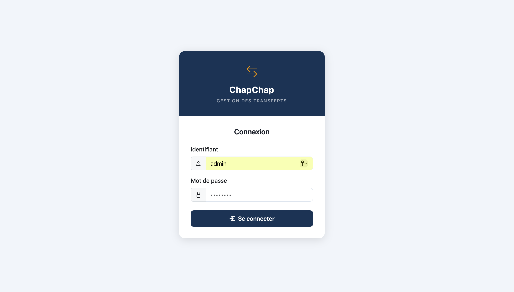
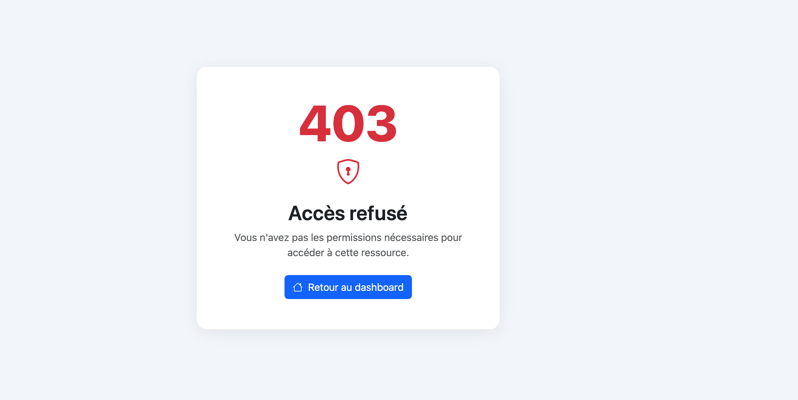
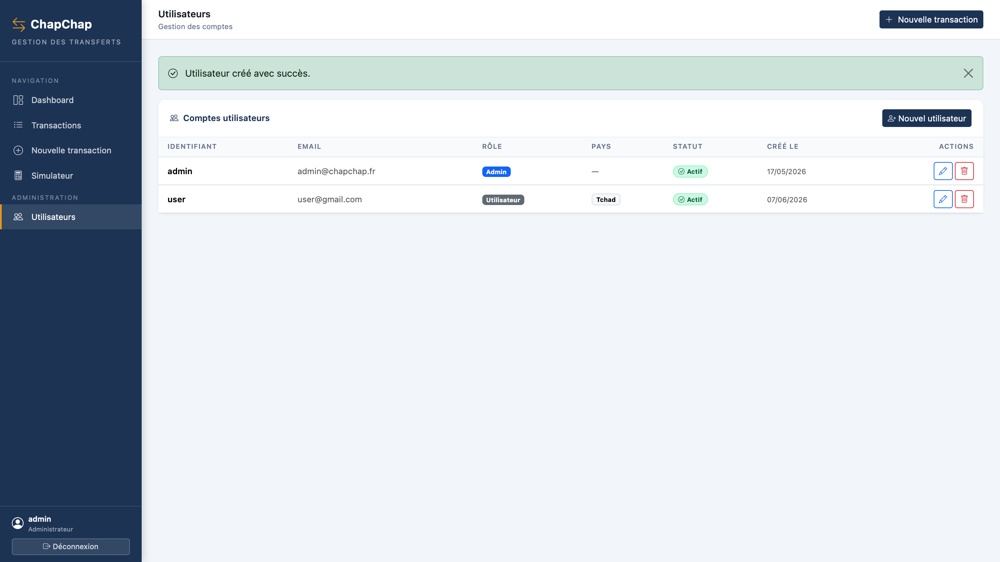
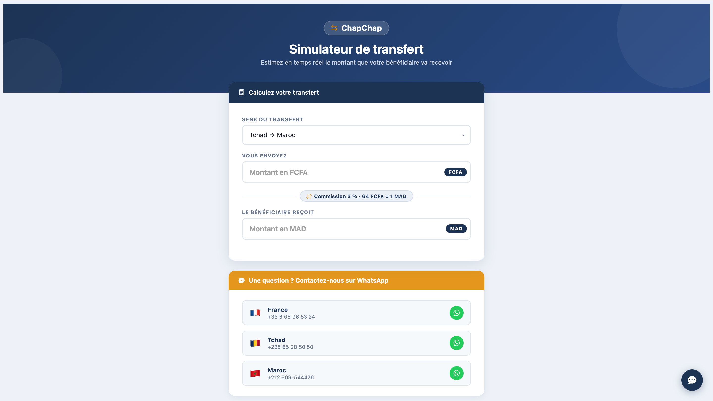
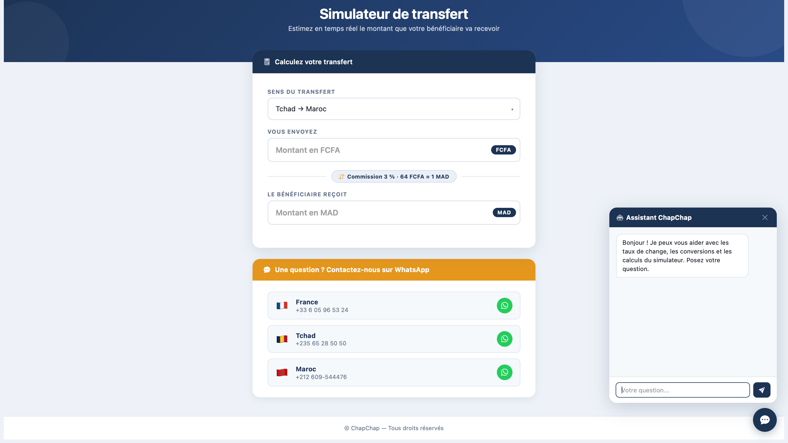
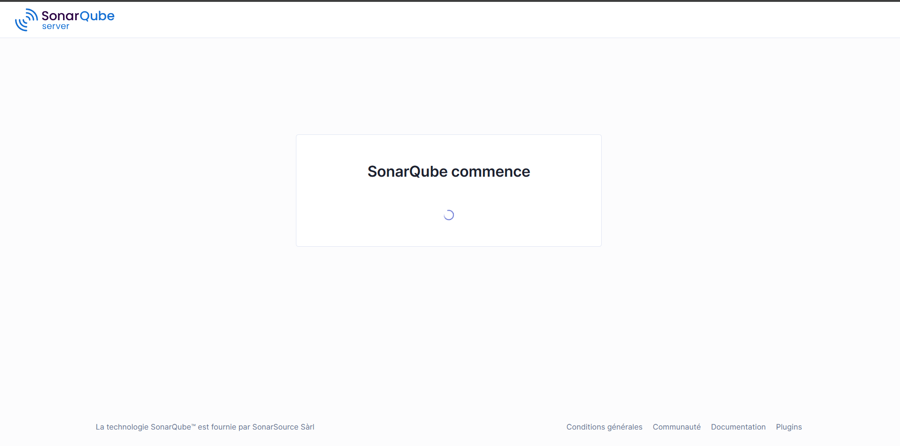
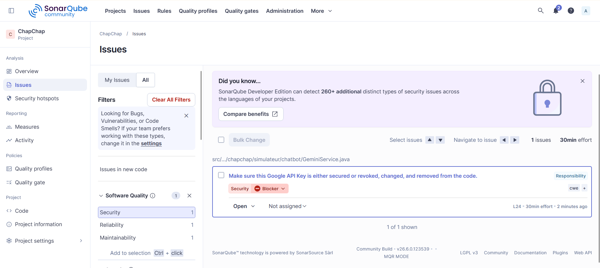
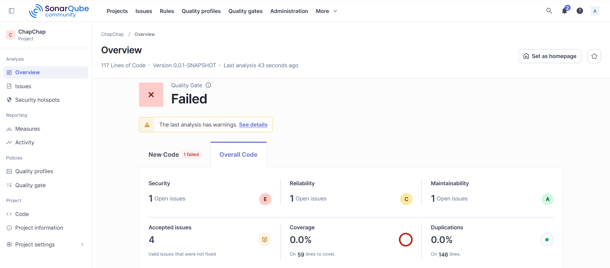
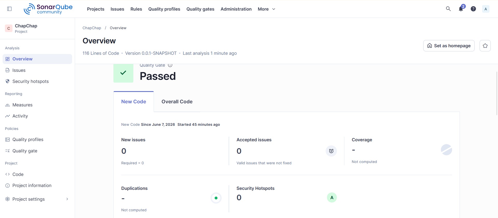

# ChapChap — Application sécurisée de gestion de transferts internationaux

<p align="center">
  
  
  
</p>

<p align="center">
  <strong>Réalisé par</strong><br>
  <strong>Abdel-hamid Mahamat Louki</strong> & <strong>Mahamat Ahmat Timan</strong><br>
  <em>Sous la supervision du Professeur Mohamed Chibani</em><br>
  Maintenance Logicielle · Promotion 2026
</p>

> **ChapChap** est une application web métier complète, destinée à une agence de transfert d’argent. Elle trace, sécurise et automatise les flux financiers entre le Tchad, le Maroc et la France.  
> Le projet applique les standards de l’industrie : architecture MVC, Design Patterns, intégration d’une IA générative, analyse statique SonarQube et workflow Git professionnel.  
> **L’application est fonctionnelle et prête à être déployée pour l’agence.**

---

## Table des matières

- [Présentation métier](#présentation-métier)
- [Architecture & Design Patterns](#architecture--design-patterns)
- [Fonctionnalités](#fonctionnalités)
  - [Authentification et sécurité](#authentification-et-sécurité)
  - [Gestion des transactions](#gestion-des-transactions)
  - [Tableau de bord](#tableau-de-bord)
  - [Génération PDF](#génération-pdf)
  - [Simulateur & assistant IA](#simulateur--assistant-ia)
  - [Gestion des utilisateurs](#gestion-des-utilisateurs)
- [Qualité logicielle – SonarQube](#qualité-logicielle--sonarqube)
  - [Configuration de l’environnement](#configuration-de-lenvironnement)
  - [Détection d’une vulnérabilité critique](#détection-dune-vulnérabilité-critique)
  - [Avant / Après refactoring](#avant--après-refactoring)
- [Workflow Git & Versioning](#workflow-git--versioning)
- [Structure du projet](#structure-du-projet)
- [Stack technique](#stack-technique)
- [Installation et lancement](#installation-et-lancement)
  - [Prérequis](#prérequis)
  - [Installation](#installation)
  - [Compte par défaut](#compte-par-défaut)
  - [Analyse SonarQube](#analyse-sonarqube)
- [Routes principales](#routes-principales)
- [Livrables du projet](#livrables-du-projet)
- [Contacts](#contacts)
- [Équipe](#équipe)

---

## Présentation métier

Les agences de transfert Tchad-Maroc sont confrontées à trois défis majeurs :
- **Opacité des commissions** et des taux de change appliqués
- **Fragilité du code** (clés API en dur, absence d’audit de sécurité)
- **Surcharge du support** pour des demandes répétitives d’estimation de frais

**ChapChap apporte une réponse concrète :**
- Un back-office sécurisé (CRUD transactions, export PDF) réservé aux opérateurs
- Un simulateur public augmenté par IA qui automatise les calculs et répond aux questions des utilisateurs
- Un pipeline qualité continu (SonarQube) garantissant un code sans vulnérabilités et maintenable

---

## Architecture & Design Patterns

L’application suit une **architecture multicouche MVC** imposée par Spring Boot.  
Les responsabilités sont strictement séparées entre les contrôleurs, les services métier et la couche d’accès aux données.

### Patterns mis en œuvre

| Pattern | Implémentation | Bénéfice |
|--------|----------------|----------|
| **DTO** (Data Transfer Object) | `TransactionDTO`, `UserDTO` | Isole les entités JPA, prévient le *mass assignment* et masque les données sensibles (hash du mot de passe) |
| **Facade** | `GeminiService` | Cache la complexité des appels HTTP à l’API Groq, la gestion du token et l’injection du contexte RAG |

Ces choix réduisent le couplage, facilitent les tests unitaires et simplifient la maintenance future.

---

## Fonctionnalités

### Authentification et sécurité

- Connexion via formulaire (`/login`), déconnexion via `/logout`
- Mots de passe chiffrés en BCrypt
- Contrôle d’accès par rôle (`ADMIN`, `MANAGER`, `USER`) et par pays d’affectation
- Pages d’erreur personnalisées (403, 404)

<p align="center" style="margin: 30px 0;">
  <span style="display: flex; gap: 20px; justify-content: center; flex-wrap: wrap;">
    <span style="border-radius: 24px; overflow: hidden; box-shadow: 0 20px 40px rgba(0,0,0,0.15); flex: 1; min-width: 250px; max-width: 300px; display: flex; flex-direction: column; align-items: center;">
      <strong style="margin: 12px 0 8px 0;">Page de connexion</strong>
      
      <em style="margin: 8px 0 12px 0; padding: 0 10px;">Formulaire d’authentification sécurisé</em>
    </span>
    <span style="border-radius: 24px; overflow: hidden; box-shadow: 0 20px 40px rgba(0,0,0,0.15); flex: 1; min-width: 250px; max-width: 300px; display: flex; flex-direction: column; align-items: center;">
      <strong style="margin: 12px 0 8px 0;">Accès refusé</strong>
      
      <em style="margin: 8px 0 12px 0; padding: 0 10px;">Page d’erreur 403 personnalisée</em>
    </span>
    <span style="border-radius: 24px; overflow: hidden; box-shadow: 0 20px 40px rgba(0,0,0,0.15); flex: 1; min-width: 250px; max-width: 300px; display: flex; flex-direction: column; align-items: center;">
      <strong style="margin: 12px 0 8px 0;">Gestion des utilisateurs</strong>
      
      <em style="margin: 8px 0 12px 0; padding: 0 10px;">Interface d’administration (ADMIN)</em>
    </span>
  </span>
</p>

### Gestion des transactions

- Créer, modifier, valider et rejeter des transactions
- Attributs : montant, devise (MAD, XAF), type (ENTREE, SORTIE), statut, personne concernée, canal, date, preuve jointe (fichier uploadé)
- Filtres sur la liste : statut, devise, plage de dates
- Upload de pièce justificative (5 Mo max, stockée dans `uploads/preuves/`)

**Statuts des transactions :**

| Statut | Description |
|---|---|
| `EN_ATTENTE` | Créée, en attente de traitement |
| `CONFIRMEE` | Validée par un utilisateur autorisé |
| `REJETEE` | Refusée (ADMIN uniquement) |

Seules les transactions `EN_ATTENTE` peuvent être modifiées ou supprimées.

### Tableau de bord

- Compteurs par statut (en attente, confirmées, rejetées)
- Soldes calculés par devise (MAD et XAF) sur les transactions confirmées
- Filtrage par plage de dates
- Tableau des 10 dernières transactions

### Génération PDF

- **Reçu de transaction** (`/transactions/{id}/recu`) : document individuel avec référence `TXN-XXXXXX`, montant, statut, détails de la personne
- **Facture / rapport** (`/transactions/facture`) : rapport global avec statistiques entrées/sorties/solde par devise

### Simulateur & assistant IA

Simulateur bidirectionnel accessible sans connexion sur `/simulateur`. Calcul des montants pour les corridors suivants :

| Corridor | Taux | Commission |
|---|---|---|
| Tchad → Maroc | 64 FCFA = 1 MAD | 3 % sur l’envoi |
| Maroc → Tchad | 1 MAD = 61 FCFA | incluse dans le taux |
| France → Tchad | 1 EUR = 655 FCFA | incluse dans le taux |
| Tchad → France | 700 FCFA = 1 EUR | incluse dans le taux |

On peut saisir le montant envoyé ou le montant reçu.

**Chatbot IA** intégré au simulateur. Il répond aux questions sur les taux et les calculs en s’appuyant sur un contexte RAG (`simulateur-rag.txt`) injecté à chaque requête envoyée à l’API Groq (modèle `llama-3.3-70b-versatile`). Le chatbot répond uniquement en français.

<p align="center" style="margin: 30px 0;">
  <span style="display: flex; gap: 20px; justify-content: center; flex-wrap: wrap;">
    <span style="border-radius: 24px; overflow: hidden; box-shadow: 0 20px 40px rgba(0,0,0,0.15); flex: 1; min-width: 280px; max-width: 400px; display: flex; flex-direction: column; align-items: center;">
      <strong style="margin: 12px 0 8px 0;">Simulateur de transfert</strong>
      
      <em style="margin: 8px 0 12px 0; padding: 0 10px;">Calcul bidirectionnel des frais</em>
    </span>
    <span style="border-radius: 24px; overflow: hidden; box-shadow: 0 20px 40px rgba(0,0,0,0.15); flex: 1; min-width: 280px; max-width: 400px; display: flex; flex-direction: column; align-items: center;">
      <strong style="margin: 12px 0 8px 0;">Assistant IA</strong>
      
      <em style="margin: 8px 0 12px 0; padding: 0 10px;">Agent conversationnel contextuel</em>
    </span>
  </span>
</p>

### Gestion des utilisateurs

Accessible via `/admin/users` (ADMIN uniquement) :
- Créer, modifier, supprimer des utilisateurs
- Assigner un rôle et un pays d’affectation
- Impossible de supprimer son propre compte

---

## Qualité logicielle – SonarQube

Un serveur **SonarQube** est provisionné localement via Docker pour auditer le code en continu.  
La politique de qualité est **zéro défaut critique** avant chaque livraison.

### Configuration de l’environnement

<p align="center" style="margin: 30px 0;">
  <span style="display: inline-block; border-radius: 24px; overflow: hidden; box-shadow: 0 20px 40px rgba(0,0,0,0.15);">
    <strong style="display: block; margin: 12px 0 8px 0; text-align: center;">Déploiement Docker de SonarQube</strong>
    
    <em style="display: block; margin: 8px 0 12px 0; text-align: center;">Interface d’administration après provisionnement</em>
  </span>
</p>

### Détection d’une vulnérabilité critique

L’analyse a immédiatement repéré une **clé d’API Groq inscrite en dur** dans le code source.  
✅ **Correction :** extraction dans `application.properties` et injection via variable d’environnement `GROQ_API_KEY`.

<p align="center" style="margin: 30px 0;">
  <span style="display: inline-block; border-radius: 24px; overflow: hidden; box-shadow: 0 20px 40px rgba(0,0,0,0.15);">
    <strong style="display: block; margin: 12px 0 8px 0; text-align: center;">Vulnérabilité de sécurité</strong>
    
    <em style="display: block; margin: 8px 0 12px 0; text-align: center;">Secret détecté dans le code source</em>
  </span>
</p>

### Avant / Après refactoring

La dette technique a été résorbée en deux itérations : remplacement des injections par attribut par des injections par constructeur, et suppression de la vulnérabilité.

| Avant (Quality Gate : FAILED) | Après (Quality Gate : PASSED) |
|--------------------------------|-------------------------------|
| <span style="border-radius: 24px; overflow: hidden; box-shadow: 0 20px 40px rgba(0,0,0,0.15); display: flex; flex-direction: column; align-items: center;"><strong style="margin: 12px 0 8px 0;">Rapport initial</strong><em style="margin: 8px 0 12px 0;">Vulnérabilité sécurité + code smells</em></span> | <span style="border-radius: 24px; overflow: hidden; box-shadow: 0 20px 40px rgba(0,0,0,0.15); display: flex; flex-direction: column; align-items: center;"><strong style="margin: 12px 0 8px 0;">Rapport final</strong><em style="margin: 8px 0 12px 0;">Code sain, sécurité A, maintenabilité optimisée</em></span> |

---

## Workflow Git & Versioning

Le dépôt suit un modèle de travail strict, simulant un environnement d’intégration continue :

- **Branche `main` protégée** – aucun commit direct
- **Pull Requests obligatoires** pour fusionner `feature/*` et `hotfix/*`
- **Conventional Commits** : `feat:`, `fix:`, `refactor:`, `chore:`, …
- **Tags de release** : la version stable est figée par le tag **`v1.0.0`**
- **Hotfix** : une branche `hotfix/auth-bloquant` a été créée en cours de sprint pour résoudre un problème d’authentification sans interrompre le développement

---

## Structure du projet

```
src/main/java/fr/zenabkissir/chapchap/
├── ChapChapApplication.java          # Point d'entrée Spring Boot
├── personne/                         # Contacts (destinataires/émetteurs)
│   ├── entity/Personne.java
│   ├── repository/PersonneRepository.java
│   └── service/PersonneService(Impl).java
├── transaction/                      # Module principal
│   ├── controller/
│   │   ├── TransactionController.java  # CRUD + validation/rejet
│   │   ├── FactureController.java      # Export PDF rapport
│   │   └── RecuController.java         # Export PDF reçu
│   ├── dto/TransactionDTO.java
│   ├── entity/Transaction.java
│   ├── entity/TransactionPreuve.java
│   ├── repository/TransactionRepository.java
│   └── service/
│       ├── TransactionService(Impl).java
│       ├── FactureService(Impl).java   # Génération PDF facture
│       └── RecuService(Impl).java      # Génération PDF reçu
├── simulateur/                       # Simulateur de transfert
│   ├── SimulateurController.java
│   └── chatbot/
│       ├── ChatbotController.java      # Endpoint POST /api/simulateur/chat
│       └── GeminiService.java          # Appel API Groq (RAG + LLM)
├── user/                             # Gestion des utilisateurs
│   ├── controller/UserController.java
│   ├── dto/UserDTO.java
│   ├── entity/User.java
│   ├── repository/UserRepository.java
│   └── service/
│       ├── UserService(Impl).java
│       ├── CustomUserDetails.java
│       └── UserDetailsServiceImpl.java
└── shared/
    ├── DataInitializer.java           # Création du compte admin au démarrage
    ├── config/SecurityConfig.java     # Règles Spring Security
    ├── config/WebMvcConfig.java
    ├── controller/GlobalControllerAdvice.java
    └── enums/
        ├── Canal.java                 # VIREMENT, ESPECES, AUTRE
        ├── Devise.java                # MAD, XAF
        ├── Pays.java                  # MAROC, TCHAD
        ├── Role.java                  # ADMIN, USER, MANAGER
        ├── TransactionStatus.java     # EN_ATTENTE, CONFIRMEE, REJETEE
        └── TransactionType.java       # ENTREE, SORTIE
```

---

## Stack technique

| Couche | Technologie |
|---|---|
| Backend | Spring Boot 4.0.5, Java 17 |
| Persistance | Spring Data JPA + Hibernate, MySQL 8 |
| Frontend | Thymeleaf, Bootstrap 5 (responsive) |
| Sécurité | Spring Security 6 (form login, BCrypt) |
| PDF | OpenPDF 3.0.4 |
| IA / Chatbot | API Groq – modèle `llama-3.3-70b-versatile` |
| Analyse statique | SonarQube (Docker), Sonar Scanner Maven |
| Build | Maven 3.9+ |

---

## Installation et lancement

### Prérequis

- Java 17+
- Maven 3.9+ (ou utiliser `./mvnw`)
- MySQL 8+ (port **8889** en dev, configurable)
- Docker & Docker Compose (pour SonarQube)
- Une clé API Groq (https://console.groq.com)

### Installation

1. **Cloner le dépôt**
   ```bash
   git clone https://github.com/votre-organisation/ChapChap.git
   cd ChapChap
   ```

2. **Configurer la base de données**

   Modifier `src/main/resources/application-dev.properties` :
   ```properties
   spring.datasource.url=jdbc:mysql://localhost:8889/ChapChap?createDatabaseIfNotExist=true
   spring.datasource.username=root
   spring.datasource.password=root
   ```
   La base est créée automatiquement (`ddl-auto=update`).

3. **Configurer la clé API Groq**

   Dans `src/main/resources/application.properties` :
   ```properties
   groq.api.key=votre_cle_api_groq
   ```

4. **Lancer l’application**
   ```bash
   ./mvnw spring-boot:run
   ```
   L’application démarre sur **http://localhost:9000**

### Compte par défaut

| Champ | Valeur |
|---|---|
| Identifiant | `admin` |
| Mot de passe | `admin123` |
| Rôle | `ADMIN` |

### Analyse SonarQube

```bash
mvn clean verify sonar:sonar \
  -DskipTests \
  -Dsonar.projectKey=ChapChap \
  -Dsonar.host.url=http://localhost:9000 \
  -Dsonar.token=<VOTRE_TOKEN_SONAR>
```

---

## Routes principales

| Méthode | URL | Accès | Description |
|---|---|---|---|
| GET | `/login` | Public | Page de connexion |
| GET | `/simulateur` | Public | Simulateur de transfert |
| POST | `/api/simulateur/chat` | Public | Chatbot IA |
| GET | `/transactions/dashboard` | Authentifié | Tableau de bord |
| GET | `/transactions` | Authentifié | Liste des transactions |
| GET/POST | `/transactions/nouveau` | ADMIN, USER | Créer une transaction |
| GET/POST | `/transactions/{id}/modifier` | ADMIN, USER | Modifier une transaction |
| POST | `/transactions/{id}/valider` | ADMIN, USER | Valider une transaction |
| POST | `/transactions/{id}/rejeter` | ADMIN | Rejeter une transaction |
| POST | `/transactions/{id}/supprimer` | ADMIN, USER | Supprimer une transaction |
| GET | `/transactions/{id}/recu` | Authentifié | Télécharger le reçu PDF |
| GET | `/transactions/facture` | Authentifié | Télécharger la facture PDF |
| GET | `/admin/users` | ADMIN | Liste des utilisateurs |
| GET/POST | `/admin/users/nouveau` | ADMIN | Créer un utilisateur |
| GET/POST | `/admin/users/{id}/modifier` | ADMIN | Modifier un utilisateur |
| POST | `/admin/users/{id}/supprimer` | ADMIN | Supprimer un utilisateur |

---

## Livrables du projet

Conformément aux exigences du module, le projet comprend :

- Dépôt Git structuré avec branches `feature`, `hotfix` et Pull Requests
- MVP fonctionnel (CRUD transactions, dashboard, génération PDF)
- Intégration d’une IA (chatbot contextuel via API Groq)
- Application de design patterns (DTO et Facade)
- Analyse et correction d’au moins 2 issues SonarQube (vulnérabilité de sécurité + code smells)
- README professionnel
- Offre commerciale (document séparé)
- Présentation finale

---

## Contacts

| Pays | Numéro WhatsApp |
|---|---|
| France | +33 6 05 96 53 24 |
| Tchad | +235 65 28 50 50 |
| Maroc | +212 609-544476 |

---

## Équipe

| Membre | Rôle principal | Contributions clés |
|---|---|---|
| **Abdel-hamid Mahamat Louki** | Workflow & Quality Lead | Stratégie Git, gestion des Pull Requests, release `v1.0.0` ; déploiement SonarQube, pilotage du refactoring et des Design Patterns |
| **Mahamat Ahmat Timan** | Feature & Documentation Lead | Développement du noyau métier (CRUD, Spring Security) ; intégration de l’IA (API Groq, RAG) ; rédaction de la documentation technique et de l’offre commerciale |

---

<p align="center" style="margin-top: 50px;">
  Projet supervisé par le <strong>Professeur Mohamed Chibani</strong><br>
  <strong>ChapChap</strong> — quand l’ingénierie logicielle répond aux besoins réels des agences financières.
</p>