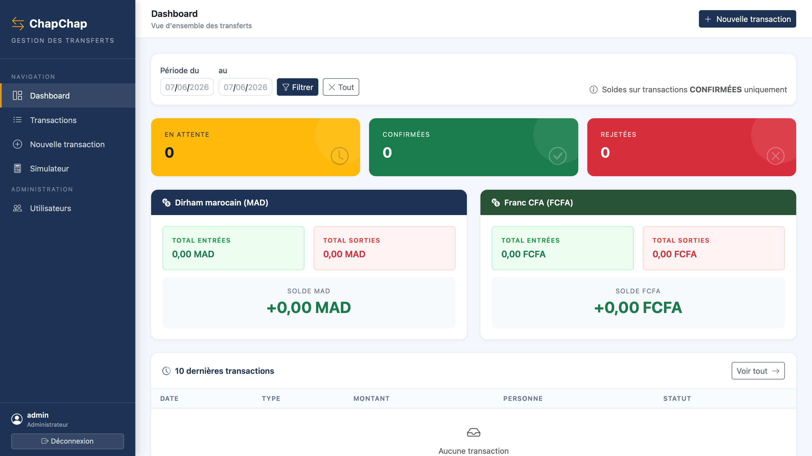
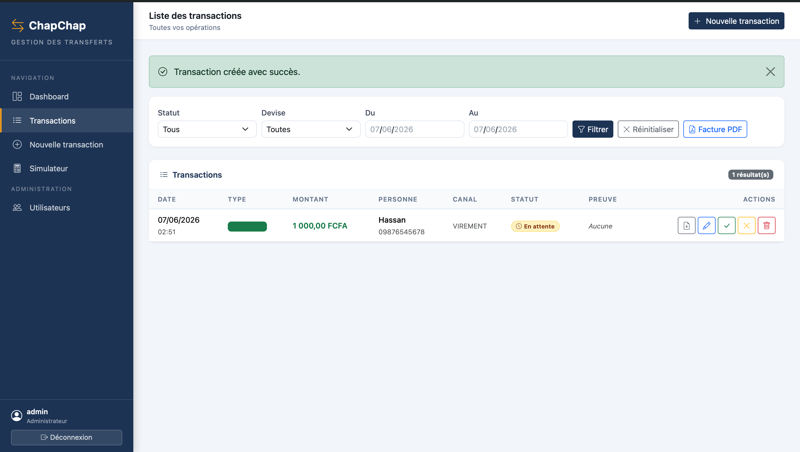

# ChapChap — Gestion de transferts d'argent internationaux

ChapChap est une application web de gestion de transferts d'argent entre le Tchad, le Maroc et la France. Elle permet de saisir, valider et suivre des transactions financières, de générer des reçus et factures PDF, et propose un simulateur de conversion avec un chatbot IA intégré.

---

## Captures d'écran

| Login | Dashboard |
|---|---|
|  |  |

| Transactions | Simulateur | Chatbot |
|---|---|---|
|  |  |  |

---

## Stack technique

| Couche | Technologie |
|---|---|
| Backend | Spring Boot 4.0.5, Java 17 |
| Persistance | Spring Data JPA + Hibernate, MySQL |
| Frontend | Thymeleaf, Bootstrap (layout responsive) |
| Sécurité | Spring Security 6 (form login, BCrypt) |
| PDF | OpenPDF 3.0.4 |
| IA / Chatbot | API Groq — modèle `llama-3.3-70b-versatile` |
| Build | Maven (mvnw) |

---

## Prérequis

- Java 17+
- Maven 3.9+ (ou utiliser `./mvnw`)
- MySQL 8+ (port **8889** en dev, configurable)
- Une clé API Groq (console : https://console.groq.com)

---

## Installation et lancement

### 1. Cloner le dépôt

```bash
git clone <url-du-repo>
cd ChapChap
```

### 2. Configurer la base de données

Modifier `src/main/resources/application-dev.properties` :

```properties
spring.datasource.url=jdbc:mysql://localhost:8889/ChapChap?createDatabaseIfNotExist=true
spring.datasource.username=root
spring.datasource.password=root
```

La base de données est créée automatiquement au démarrage (`ddl-auto=update`).

### 3. Configurer la clé API Groq

Dans `src/main/resources/application.properties` :

```properties
groq.api.key=votre_cle_api_groq
```

### 4. Lancer l'application

```bash
./mvnw spring-boot:run
```

L'application démarre sur **http://localhost:9000**

---

## Compte par défaut

Au premier démarrage, un compte administrateur est créé automatiquement :

| Champ | Valeur |
|---|---|
| Identifiant | `admin` |
| Mot de passe | `admin123` |
| Rôle | `ADMIN` |

---

## Fonctionnalités

### Authentification et sécurité
- Connexion via formulaire (`/login`), déconnexion via `/logout`
- Mots de passe chiffrés en BCrypt
- Contrôle d'accès par rôle et par pays d'affectation

### Gestion des transactions
- Créer, modifier, valider et rejeter des transactions
- Chaque transaction possède : montant, devise, type (Entrée/Sortie), statut, personne concernée, canal, date et preuve jointe (fichier uploadé)
- **Filtres** sur la liste : statut, devise, plage de dates
- Upload de pièce justificative (5 Mo max, stocké dans `uploads/preuves/`)

### Statuts des transactions

| Statut | Description |
|---|---|
| `EN_ATTENTE` | Créée, en attente de traitement |
| `CONFIRMEE` | Validée par un ADMIN ou USER autorisé |
| `REJETEE` | Refusée (ADMIN uniquement) |

> Seules les transactions `EN_ATTENTE` peuvent être modifiées ou supprimées.

### Dashboard
- Compteurs par statut (en attente, confirmées, rejetées)
- Soldes calculés par devise (MAD et XAF) sur les transactions confirmées
- Filtrage par plage de dates
- Tableau des 10 dernières transactions

### Génération PDF
- **Reçu de transaction** (`/transactions/{id}/recu`) : document individuel avec référence `TXN-XXXXXX`, montant, statut, détails de la personne
- **Facture / rapport** (`/transactions/facture`) : rapport de l'ensemble des transactions avec statistiques entrées/sorties/solde par devise

### Simulateur de transfert
Accessible sans connexion sur `/simulateur`. Calcule les montants pour les corridors suivants :

| Corridor | Taux | Commission |
|---|---|---|
| Tchad → Maroc | 64 FCFA = 1 MAD | 3 % sur l'envoi |
| Maroc → Tchad | 1 MAD = 61 FCFA | incluse dans le taux |
| France → Tchad | 1 EUR = 655 FCFA | incluse dans le taux |
| Tchad → France | 700 FCFA = 1 EUR | incluse dans le taux |

Le calcul est **bidirectionnel** : on peut saisir le montant envoyé ou le montant reçu.

### Chatbot IA
Intégré au simulateur. Répond aux questions sur les taux de change et les calculs, en s'appuyant sur un contexte RAG (`simulateur-rag.txt`) injecté dans chaque requête envoyée à l'API Groq (modèle `llama-3.3-70b-versatile`). Le chatbot répond uniquement en français.

### Gestion des utilisateurs (ADMIN)
Accessible via `/admin/users` :
- Créer, modifier, supprimer des utilisateurs
- Assigner un rôle et un pays d'affectation
- Impossible de supprimer son propre compte

---

## Rôles et permissions

| Action | ADMIN | USER | MANAGER |
|---|---|---|---|
| Dashboard | ✓ | ✓ | ✓ |
| Voir les transactions | ✓ | ✓ | ✓ |
| Créer une transaction | ✓ | ✓ | ✗ |
| Modifier une transaction | ✓ | ✓ | ✗ |
| Valider une transaction | ✓ | ✓ | ✗ |
| Rejeter une transaction | ✓ | ✗ | ✗ |
| Supprimer une transaction | ✓ | ✓ | ✗ |
| Gestion des utilisateurs | ✓ | ✗ | ✗ |

> Les utilisateurs avec le rôle `USER` n'accèdent qu'aux transactions de leur pays (MAD pour Maroc, XAF pour Tchad).

---

## Structure du projet

```
src/main/java/fr/zenabkissir/chapchap/
├── ChapChapApplication.java          # Point d'entrée Spring Boot
├── personne/                         # Contacts (destinataires/émetteurs)
│   ├── entity/Personne.java
│   ├── repository/PersonneRepository.java
│   └── service/PersonneService(Impl).java
├── transaction/                      # Module principal
│   ├── controller/
│   │   ├── TransactionController.java  # CRUD + validation/rejet
│   │   ├── FactureController.java      # Export PDF rapport
│   │   └── RecuController.java         # Export PDF reçu
│   ├── dto/TransactionDTO.java
│   ├── entity/Transaction.java
│   ├── entity/TransactionPreuve.java
│   ├── repository/TransactionRepository.java
│   └── service/
│       ├── TransactionService(Impl).java
│       ├── FactureService(Impl).java   # Génération PDF facture
│       └── RecuService(Impl).java      # Génération PDF reçu
├── simulateur/                       # Simulateur de transfert
│   ├── SimulateurController.java
│   └── chatbot/
│       ├── ChatbotController.java      # Endpoint POST /api/simulateur/chat
│       └── GeminiService.java          # Appel API Groq (RAG + LLM)
├── user/                             # Gestion des utilisateurs
│   ├── controller/UserController.java
│   ├── dto/UserDTO.java
│   ├── entity/User.java
│   ├── repository/UserRepository.java
│   └── service/
│       ├── UserService(Impl).java
│       ├── CustomUserDetails.java
│       └── UserDetailsServiceImpl.java
└── shared/
    ├── DataInitializer.java           # Création du compte admin au démarrage
    ├── config/SecurityConfig.java     # Règles Spring Security
    ├── config/WebMvcConfig.java
    ├── controller/GlobalControllerAdvice.java
    └── enums/
        ├── Canal.java                 # VIREMENT, ESPECES, AUTRE
        ├── Devise.java                # MAD, XAF
        ├── Pays.java                  # MAROC, TCHAD
        ├── Role.java                  # ADMIN, USER, MANAGER
        ├── TransactionStatus.java     # EN_ATTENTE, CONFIRMEE, REJETEE
        └── TransactionType.java       # ENTREE, SORTIE
```

---

## Routes principales

| Méthode | URL | Accès | Description |
|---|---|---|---|
| GET | `/login` | Public | Page de connexion |
| GET | `/simulateur` | Public | Simulateur de transfert |
| POST | `/api/simulateur/chat` | Public | Chatbot IA |
| GET | `/transactions/dashboard` | Authentifié | Tableau de bord |
| GET | `/transactions` | Authentifié | Liste des transactions |
| GET/POST | `/transactions/nouveau` | ADMIN, USER | Créer une transaction |
| GET/POST | `/transactions/{id}/modifier` | ADMIN, USER | Modifier une transaction |
| POST | `/transactions/{id}/valider` | ADMIN, USER | Valider une transaction |
| POST | `/transactions/{id}/rejeter` | ADMIN | Rejeter une transaction |
| POST | `/transactions/{id}/supprimer` | ADMIN, USER | Supprimer une transaction |
| GET | `/transactions/{id}/recu` | Authentifié | Télécharger le reçu PDF |
| GET | `/transactions/facture` | Authentifié | Télécharger la facture PDF |
| GET | `/admin/users` | ADMIN | Liste des utilisateurs |
| GET/POST | `/admin/users/nouveau` | ADMIN | Créer un utilisateur |
| GET/POST | `/admin/users/{id}/modifier` | ADMIN | Modifier un utilisateur |
| POST | `/admin/users/{id}/supprimer` | ADMIN | Supprimer un utilisateur |

---

## Contacts ChapChap (WhatsApp)

| Pays | Numéro |
|---|---|
| France | +33 6 05 96 53 24 |
| Tchad | +235 65 28 50 50 |
| Maroc | +212 609-544476 |